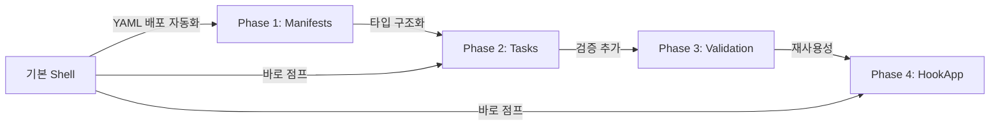
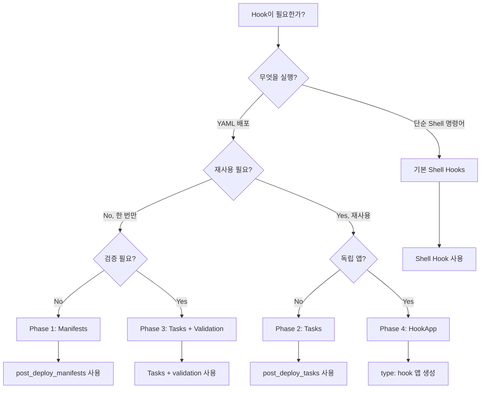

# SBKube Hooks 마이그레이션 가이드

> **대상**: 기존 Hooks를 사용 중이거나 고급 기능으로 업그레이드하려는 사용자

## 목차

1. [개요](#개요)
2. [Phase별 마이그레이션 경로](#phase별-마이그레이션-경로)
3. [기본 Shell → Phase 1 Manifests](#기본-shell--phase-1-manifests)
4. [Phase 1 → Phase 2 Tasks](#phase-1--phase-2-tasks)
5. [Phase 2 → Phase 3 (Validation)](#phase-2--phase-3-validation)
6. [Phase 3 → Phase 4 (HookApp)](#phase-3--phase-4-hookapp)
7. [Decision Tree](#decision-tree)
8. [일반적인 마이그레이션 시나리오](#일반적인-마이그레이션-시나리오)

---

## 개요

SBKube Hooks는 4개의 Phase를 거치며 진화했습니다. 각 Phase는 **하위 호환성을 유지**하므로, 기존 설정은 그대로 작동하며 점진적으로 업그레이드할 수 있습니다.

### 왜 마이그레이션하나요?

| 문제 | 해결 Phase | 장점 |
|------|-----------|------|
| kubectl apply를 수동으로 작성해야 함 | Phase 1 | SBKube가 자동 처리 |
| Manifests + Command 혼합 시 복잡함 | Phase 2 | 타입별 구조화 |
| 실행 결과 검증이 어려움 | Phase 3 | 자동 검증 및 롤백 |
| Hook 재사용이 어려움 | Phase 4 | 독립된 HookApp으로 관리 |

### 마이그레이션 원칙

1. **점진적**: 한 번에 하나씩 마이그레이션
2. **선택적**: 모든 Hook을 업그레이드할 필요 없음
3. **호환성**: 이전 Phase와 새 Phase 혼합 사용 가능

---

## Phase별 마이그레이션 경로



**추천 경로**:
- **간단한 YAML 배포**: 기본 → Phase 1
- **복잡한 워크플로우**: 기본 → Phase 2 → Phase 3
- **재사용 가능한 Hook**: Phase 3 → Phase 4

---

## 기본 Shell → Phase 1 Manifests

### Before: Shell Hook으로 YAML 배포

```yaml
apps:
  - name: cert-manager
    type: helm
    specs:
      repo: jetstack
      chart: cert-manager

    hooks:
      post_deploy:
        - |
          # 수동으로 kubectl apply 실행
          kubectl apply -f manifests/cluster-issuer.yaml
          kubectl wait --for=condition=ready clusterissuer/letsencrypt-prod --timeout=60s
```

**문제점**:
- kubectl 명령어를 직접 작성해야 함
- 에러 처리가 복잡함 (실패 시 수동으로 확인)
- YAML 파일 경로 오류에 취약함

### After: Phase 1 Manifests

```yaml
apps:
  - name: cert-manager
    type: helm
    specs:
      repo: jetstack
      chart: cert-manager

    hooks:
      # SBKube가 자동으로 kubectl apply 실행
      post_deploy_manifests:
        - path: manifests/cluster-issuer.yaml
```

**개선 사항**:
- ✅ kubectl 명령어 불필요
- ✅ SBKube가 자동으로 에러 처리
- ✅ 경로 검증 (파일 존재 확인)
- ✅ 네임스페이스 자동 설정

### 마이그레이션 체크리스트

- [ ] Shell Hook에서 `kubectl apply` 패턴 찾기
- [ ] `post_deploy_manifests` 또는 `pre_deploy_manifests`로 변환
- [ ] `path` 필드에 YAML 파일 경로 지정
- [ ] Wait 로직이 필요하면 별도 Shell Hook으로 분리
- [ ] 테스트 실행: `sbkube deploy --dry-run`

---

## Phase 1 → Phase 2 Tasks

### Before: Phase 1 Manifests만 사용

```yaml
apps:
  - name: keycloak
    type: helm

    hooks:
      post_deploy_manifests:
        - path: manifests/realm-config.yaml

      post_deploy:
        - |
          # Shell Hook으로 검증
          kubectl wait --for=condition=ready pod -l app=keycloak --timeout=300s
          curl http://keycloak:8080/realms/myrealm
```

**문제점**:
- Manifests와 Command가 분리되어 관리 복잡
- 실행 순서가 불명확
- Inline YAML 지원 안 됨

### After: Phase 2 Tasks

```yaml
apps:
  - name: keycloak
    type: helm

    hooks:
      post_deploy_tasks:
        # Task 1: Manifests 배포
        - type: manifests
          name: deploy-realm-config
          paths:
            - manifests/realm-config.yaml

        # Task 2: Pod Ready 대기
        - type: command
          name: wait-keycloak-ready
          command:
            - bash
            - -c
            - |
              kubectl wait --for=condition=ready pod \
                -l app=keycloak --timeout=300s

        # Task 3: 검증
        - type: command
          name: verify-realm
          command: ["curl", "http://keycloak:8080/realms/myrealm"]
```

**개선 사항**:
- ✅ 타입별 작업 구조화 (`manifests`, `command`)
- ✅ Task 이름으로 명확한 식별
- ✅ 실행 순서 명시적 (리스트 순서)
- ✅ Inline YAML 지원 추가

### 마이그레이션 체크리스트

- [ ] `post_deploy_manifests` → `post_deploy_tasks`로 변환
- [ ] 각 작업에 `type: manifests` 지정
- [ ] Shell Hook도 `type: command`로 변환
- [ ] 각 Task에 `name` 추가 (디버깅용)
- [ ] 실행 순서 확인 (리스트 순서대로 실행됨)

### Inline YAML 활용

**Before**: YAML 파일 생성 필요

```yaml
post_deploy_manifests:
  - path: manifests/temporary-configmap.yaml
```

**After**: 파일 없이 Inline 정의

```yaml
post_deploy_tasks:
  - type: inline
    yaml: |
      apiVersion: v1
      kind: ConfigMap
      metadata:
        name: temporary-config
      data:
        key: value
```

---

## Phase 2 → Phase 3 (Validation)

### Before: Phase 2 Tasks (검증 없음)

```yaml
apps:
  - name: cert-manager
    type: helm

    hooks:
      post_deploy_tasks:
        # ClusterIssuer 생성
        - type: manifests
          name: create-issuer
          paths:
            - manifests/letsencrypt-prod.yaml

        # 수동 검증 (실패해도 무시됨)
        - type: command
          name: check-issuer
          command:
            - kubectl
            - get
            - clusterissuer
            - letsencrypt-prod
          on_failure: warn
```

**문제점**:
- 리소스 생성 성공 ≠ 실제 사용 가능
- 검증 실패해도 배포는 성공 처리
- 롤백 불가능

### After: Phase 3 Validation

```yaml
apps:
  - name: cert-manager
    type: helm

    hooks:
      post_deploy_tasks:
        # ClusterIssuer 생성 + 자동 검증
        - type: manifests
          name: create-issuer
          paths:
            - manifests/letsencrypt-prod.yaml

          # Phase 3: Validation 추가
          validation:
            type: resource_ready
            resource: clusterissuer/letsencrypt-prod
            timeout: 120

          # 검증 실패 시 롤백
          rollback:
            action: delete_resource
            resource: clusterissuer/letsencrypt-prod
```

**개선 사항**:
- ✅ 리소스 Ready 상태까지 확인
- ✅ Validation 실패 시 자동 롤백
- ✅ 배포 실패로 정확히 보고

### 마이그레이션 체크리스트

- [ ] 검증이 필요한 Task 식별
- [ ] `validation` 섹션 추가
- [ ] Validation 타입 선택:
  - `resource_ready`: Pod/Deployment Ready
  - `resource_exists`: 리소스 존재 확인
  - `command_output`: 명령어 출력 검증
- [ ] `rollback` 섹션 추가 (선택)
- [ ] `timeout` 설정 (기본값: 300초)

### Validation 타입별 예시

#### 1. Resource Ready (Pod/Deployment)

```yaml
validation:
  type: resource_ready
  resource: deployment/my-app
  namespace: default
  timeout: 300
```

#### 2. Resource Exists (ConfigMap/Secret)

```yaml
validation:
  type: resource_exists
  resource: configmap/my-config
  namespace: default
  timeout: 60
```

#### 3. Command Output (HTTP Health Check)

```yaml
validation:
  type: command_output
  command: ["curl", "http://my-app:8080/health"]
  expected_output: "healthy"
  timeout: 120
```

### Dependency 추가 (Task 간 의존성)

**Before**: 순차 실행만 가능

```yaml
post_deploy_tasks:
  - type: manifests
    name: task-a
    paths: ["a.yaml"]

  - type: command
    name: task-b
    command: ["echo", "Waiting..."]
```

**After**: 명시적 Dependency

```yaml
post_deploy_tasks:
  # Task A와 B는 병렬 실행
  - type: manifests
    name: task-a
    paths: ["a.yaml"]

  - type: manifests
    name: task-b
    paths: ["b.yaml"]

  # Task C는 A와 B 모두 완료 후 실행
  - type: command
    name: task-c
    command: ["echo", "Done"]
    dependency:
      wait_for_tasks: ["task-a", "task-b"]
```

---

## Phase 3 → Phase 4 (HookApp)

### Before: App에 종속된 Hook

```yaml
apps:
  # 이 Hook은 cert-manager에만 사용 가능
  - name: cert-manager
    type: helm
    hooks:
      post_deploy_tasks:
        - type: manifests
          paths:
            - manifests/letsencrypt-staging.yaml
            - manifests/letsencrypt-prod.yaml
```

**문제점**:
- Hook을 다른 환경에서 재사용 불가
- cert-manager와 강하게 결합됨
- 독립적인 배포 단위로 관리 어려움

### After: Phase 4 HookApp

```yaml
apps:
  # 1. cert-manager (Helm 앱)
  - name: cert-manager
    type: helm
    specs:
      repo: jetstack
      chart: cert-manager

  # 2. ClusterIssuer 설정 (독립된 HookApp)
  - name: setup-cluster-issuers
    type: hook  # Phase 4: Hook이 First-class App
    enabled: true

    hooks:
      post_deploy_tasks:
        - type: manifests
          name: deploy-issuers
          paths:
            - manifests/letsencrypt-staging.yaml
            - manifests/letsencrypt-prod.yaml

        - type: command
          name: verify-issuers
          command:
            - bash
            - -c
            - |
              kubectl wait --for=condition=ready \
                clusterissuer/letsencrypt-prod --timeout=60s
          dependency:
            wait_for_tasks: ["deploy-issuers"]
```

**개선 사항**:
- ✅ 독립된 앱으로 관리 (`type: hook`)
- ✅ 재사용 가능 (다른 프로젝트에서도 사용)
- ✅ `enabled: false`로 쉽게 비활성화
- ✅ 다른 앱과 동일한 dependency 관리

### HookApp의 특징

1. **Lifecycle 간소화**:
   - `prepare`, `build`, `template` 단계를 **건너뜀**
   - `deploy` 단계에서만 실행

2. **독립적 관리**:
   - 앱 이름으로 식별 가능
   - `sbkube deploy --app setup-cluster-issuers` 개별 실행 가능

3. **Dependency 지원**:
   ```yaml
   apps:
     - name: cert-manager
       type: helm

     - name: setup-issuers
       type: hook
       # cert-manager 배포 후 실행
   ```

### 마이그레이션 체크리스트

- [ ] 재사용 가능한 Hook 식별
- [ ] 새로운 앱 정의 생성 (`type: hook`)
- [ ] 기존 Hook을 `hooks:` 섹션으로 이동
- [ ] `enabled: true` 설정
- [ ] Dependency 확인 (실행 순서)
- [ ] 테스트: 개별 배포 가능한지 확인

### 언제 HookApp을 사용할까?

| 사용 시나리오 | Phase 3 | Phase 4 HookApp |
|--------------|---------|----------------|
| 한 앱에만 종속 | ✅ | ⚠️ 과도함 |
| 여러 환경에서 재사용 | ❌ | ✅ |
| 독립적으로 배포 필요 | ❌ | ✅ |
| 복잡한 초기화 로직 | ⚠️ | ✅ |
| 다른 앱과 Dependency 필요 | ⚠️ | ✅ |

---

## Decision Tree

### 어떤 Phase를 선택해야 할까?



### 실전 예시

| 시나리오 | 추천 Phase | 이유 |
|---------|-----------|------|
| Slack 알림 전송 | 기본 Shell | 단순 명령어 실행 |
| Namespace 생성 | Phase 1 | YAML 배포, 재사용 불필요 |
| ConfigMap + 검증 | Phase 3 | YAML + Validation 필요 |
| cert-manager 초기화 | Phase 4 | 독립 앱으로 재사용 |
| DB 마이그레이션 + 롤백 | Phase 3 | Command + Validation + Rollback |

---

## 일반적인 마이그레이션 시나리오

### 시나리오 1: kubectl apply → Phase 1

**Before**:
```yaml
hooks:
  post_deploy:
    - kubectl apply -f manifests/ingress.yaml
```

**After**:
```yaml
hooks:
  post_deploy_manifests:
    - path: manifests/ingress.yaml
```

### 시나리오 2: 복잡한 Shell 스크립트 → Phase 2 Tasks

**Before**:
```yaml
hooks:
  post_deploy:
    - |
      # ConfigMap 생성
      kubectl apply -f config.yaml

      # Pod Ready 대기
      kubectl wait --for=condition=ready pod -l app=myapp --timeout=300s

      # Health Check
      curl http://myapp:8080/health
```

**After**:
```yaml
hooks:
  post_deploy_tasks:
    - type: manifests
      name: deploy-config
      paths: ["config.yaml"]

    - type: command
      name: wait-ready
      command:
        - kubectl
        - wait
        - --for=condition=ready
        - pod
        - -l
        - app=myapp
        - --timeout=300s

    - type: command
      name: health-check
      command: ["curl", "http://myapp:8080/health"]
```

### 시나리오 3: 검증 추가 (Phase 2 → 3)

**Before**:
```yaml
post_deploy_tasks:
  - type: manifests
    name: create-certificate
    paths: ["certificate.yaml"]
```

**After**:
```yaml
post_deploy_tasks:
  - type: manifests
    name: create-certificate
    paths: ["certificate.yaml"]

    validation:
      type: resource_ready
      resource: certificate/my-cert
      namespace: cert-manager
      timeout: 300

    rollback:
      action: delete_resource
      resource: certificate/my-cert
```

### 시나리오 4: 재사용 가능한 Hook (Phase 3 → 4)

**Before** (여러 프로젝트에서 복사-붙여넣기):
```yaml
# project-a/config.yaml
apps:
  - name: cert-manager
    type: helm
    hooks:
      post_deploy_tasks:
        - type: manifests
          paths: ["issuers.yaml"]

# project-b/config.yaml
apps:
  - name: cert-manager
    type: helm
    hooks:
      post_deploy_tasks:
        - type: manifests
          paths: ["issuers.yaml"]  # 중복!
```

**After** (HookApp으로 모듈화):
```yaml
# shared-hooks/cluster-issuer-setup/config.yaml
apps:
  - name: setup-cluster-issuers
    type: hook
    hooks:
      post_deploy_tasks:
        - type: manifests
          paths: ["issuers.yaml"]

# project-a/config.yaml
apps:
  - name: cert-manager
    type: helm

  # HookApp 참조 (Git 또는 로컬)
  - name: setup-cluster-issuers
    type: hook
    specs:
      source: git
      repo: https://github.com/myorg/shared-hooks
      path: cluster-issuer-setup
```

---

## 다음 단계

### 마이그레이션 후 체크리스트

- [ ] `sbkube validate` 실행하여 설정 검증
- [ ] `sbkube deploy --dry-run` 실행하여 시뮬레이션
- [ ] 실제 배포 테스트 (개발 환경)
- [ ] 로그 확인 (`--verbose` 옵션 사용)
- [ ] 문서 업데이트 (팀 내부 가이드)

### 더 알아보기

- **[Hooks 레퍼런스](./hooks-reference.md)**: 전체 Hook 타입 및 환경 변수
- **[Hooks 상세 가이드](./hooks.md)**: 실전 예제 및 Best Practices
- **[Examples](../../examples/)**: 각 Phase별 예제 코드

---

**질문이나 피드백**: [GitHub Issues](https://github.com/archmagece/sbkube/issues)
