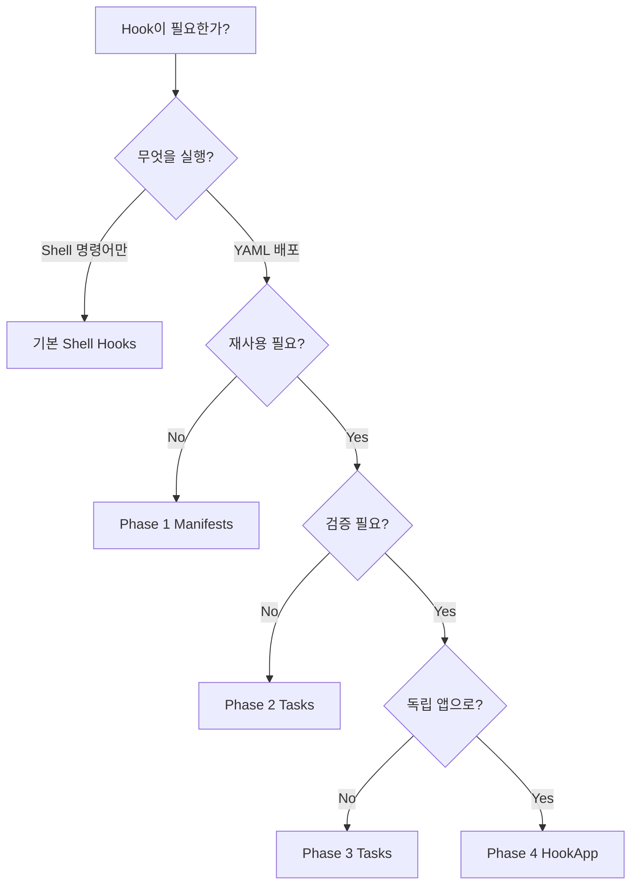

# SBKube Hooks 통합 레퍼런스

> **마지막 업데이트**: 2025-01-04 **대상 버전**: SBKube v0.8.0+

## 목차

1. [개요](#%EA%B0%9C%EC%9A%94)
1. [Hook 타입 전체 목록](#hook-%ED%83%80%EC%9E%85-%EC%A0%84%EC%B2%B4-%EB%AA%A9%EB%A1%9D)
1. [네이밍 컨벤션](#%EB%84%A4%EC%9D%B4%EB%B0%8D-%EC%BB%A8%EB%B2%A4%EC%85%98)
1. [Phase별 기능 비교](#phase%EB%B3%84-%EA%B8%B0%EB%8A%A5-%EB%B9%84%EA%B5%90)
1. [실행 순서](#%EC%8B%A4%ED%96%89-%EC%88%9C%EC%84%9C)
1. [환경 변수](#%ED%99%98%EA%B2%BD-%EB%B3%80%EC%88%98)
1. [에러 처리 전략](#%EC%97%90%EB%9F%AC-%EC%B2%98%EB%A6%AC-%EC%A0%84%EB%9E%B5)
1. [실전 가이드](#%EC%8B%A4%EC%A0%84-%EA%B0%80%EC%9D%B4%EB%93%9C)

______________________________________________________________________

## 개요

SBKube Hooks는 배포 워크플로우의 각 단계에서 커스텀 로직을 실행할 수 있는 강력한 확장 메커니즘입니다.

### Hooks의 진화

| Phase | 도입 버전 | 핵심 기능 | 상태 | |-------|----------|----------|------| | **기본 (v0.1.x)** | v0.1.0 | Shell 명령어 실행
(`pre_deploy`, `post_deploy`) | ✅ 안정 | | **Phase 1** | v0.7.0 | YAML Manifests 직접 배포 (`*_manifests`) | ✅ 안정 | | **Phase
2** | v0.8.0 | 타입 시스템 (manifests/inline/command tasks) | ✅ 안정 | | **Phase 3** | v0.8.0 | Validation, Dependency,
Rollback | ✅ 안정 | | **Phase 4** | v0.8.0 | HookApp (Hook as first-class app) | ✅ 안정 |

**호환성**: 모든 Phase는 하위 호환성을 유지하며 공존할 수 있습니다.

______________________________________________________________________

## Hook 타입 전체 목록

### 1. Command-Level Hooks

**정의 위치**: `config.yaml`의 최상위 `hooks:` 섹션

```yaml
hooks:
  deploy:
    pre: ["echo 'Starting deployment'"]
    post: ["echo 'Deployment completed'"]
    on_failure: ["echo 'Deployment failed'"]

  prepare:
    pre: ["echo 'Preparing apps'"]
    post: ["echo 'Apps prepared'"]
```

**네이밍**: YAML 객체 표기법 (점 표기법 아님)

| Hook | 실행 시점 | 용도 | |------|----------|------| | `deploy.pre` | 전체 배포 시작 전 | 전역 알림, 환경 검증 | | `deploy.post` | 전체 배포 성공
후 | 성공 알림, 정리 작업 | | `deploy.on_failure` | 배포 실패 시 | 에러 알림, 긴급 복구 | | `prepare.pre/post` | Prepare 명령어 전후 | 소스 준비 전후 작업
| | `build.pre/post` | Build 명령어 전후 | 빌드 전후 작업 | | `template.pre/post` | Template 명령어 전후 | 템플릿 렌더링 전후 작업 |

### 2. App-Level Shell Hooks

**정의 위치**: 각 앱의 `hooks:` 섹션

```yaml
apps:
  - name: redis
    type: helm
    hooks:
      pre_prepare: ["echo 'Before prepare'"]
      post_prepare: ["echo 'After prepare'"]
      pre_build: ["echo 'Before build'"]
      post_build: ["echo 'After build'"]
      pre_template: ["echo 'Before template'"]
      post_template: ["echo 'After template'"]
      pre_deploy: ["echo 'Before deploy'"]
      post_deploy: ["echo 'After deploy'"]
      on_deploy_failure: ["echo 'Deploy failed'"]
```

**네이밍**: `snake_case` (언더스코어)

| Hook | 실행 시점 | 용도 | |------|----------|------| | `pre_prepare` | 앱 prepare 전 | Git clone/Helm pull 전 준비 | |
`post_prepare` | 앱 prepare 후 | 소스 다운로드 후 검증 | | `pre_build` | 앱 build 전 | 빌드 전 설정 조정 | | `post_build` | 앱 build 후 | 빌드
결과 검증 | | `pre_template` | 앱 template 전 | 템플릿 렌더링 전 준비 | | `post_template` | 앱 template 후 | 렌더링 결과 검증 | | `pre_deploy` |
앱 배포 전 | DB 백업, 헬스체크 | | `post_deploy` | 앱 배포 성공 후 | 배포 확인, 알림 | | `on_deploy_failure` | 앱 배포 실패 시 | 롤백, 에러 로깅 |

### 3. Phase 1: Manifests Hooks

**정의 위치**: 각 앱의 `hooks:` 섹션

```yaml
apps:
  - name: cert-manager
    type: helm
    hooks:
      pre_deploy_manifests:
        - path: manifests/namespace.yaml
      post_deploy_manifests:
        - path: manifests/cluster-issuer.yaml
```

**네이밍**: `snake_case` (언더스코어)

| Hook | 타입 | 용도 | |------|------|------| | `pre_deploy_manifests` | `List[str \| dict]` | 메인 배포 전 YAML 파일 적용 | |
`post_deploy_manifests` | `List[str \| dict]` | 메인 배포 후 YAML 파일 적용 |

**Phase 1 vs Shell Hook 차이**:

- Phase 1: SBKube가 YAML을 직접 `kubectl apply` (추천)
- Shell Hook: `kubectl apply` 명령어를 사용자가 작성

### 4. Phase 2/3: Task Hooks

**정의 위치**: 각 앱의 `hooks:` 섹션

```yaml
apps:
  - name: app
    type: helm
    hooks:
      pre_deploy_tasks:
        - type: manifests
          paths: ["manifests/"]
        - type: command
          command: ["./scripts/check.sh"]

      post_deploy_tasks:
        - type: inline
          yaml: |
            apiVersion: v1
            kind: ConfigMap
            metadata:
              name: post-deploy-cm
        - type: command
          command: ["curl", "https://api.example.com/notify"]
          retry:
            max_attempts: 3
            delay: 5
```

**네이밍**: `snake_case` (언더스코어)

| Hook | Task Types | Phase 2 | Phase 3 | |------|-----------|---------|---------| | `pre_deploy_tasks` |
manifests/inline/command | ✅ | ✅ validation, dependency, rollback | | `post_deploy_tasks` | manifests/inline/command | ✅
| ✅ validation, dependency, rollback |

**Task 타입**:

| 타입 | 설명 | 주요 필드 | |------|------|----------| | `manifests` | YAML 파일 배포 | `paths`, `namespace` | | `inline` | 인라인 YAML
배포 | `yaml`, `namespace` | | `command` | Shell 명령어 실행 | `command`, `working_dir`, `retry` |

**Phase 3 추가 기능**:

| 기능 | 용도 | 예시 | |------|------|------| | **Validation** | 실행 결과 검증 | Pod Ready 확인, 리소스 존재 확인 | | **Dependency** | 다른
task 완료 대기 | Task A → Task B 순차 실행 | | **Rollback** | 실패 시 복구 | 이전 버전으로 되돌리기 |

### 5. Phase 4: HookApp

**정의 위치**: 앱 타입으로 `type: hook` 사용

```yaml
apps:
  - name: cert-manager
    type: helm
    specs:
      repo: jetstack
      chart: cert-manager

  - name: setup-issuers
    type: hook
    enabled: true
    hooks:
      post_deploy_tasks:
        - type: manifests
          paths: ["manifests/cluster-issuer.yaml"]
```

**특징**:

- Hook 자체가 하나의 앱 (`type: hook`)
- `prepare`, `build`, `template` 단계를 건너뜀
- `deploy` 단계에서만 실행
- 다른 앱과 동일하게 dependency 관리
- 재사용 가능한 독립적인 Hook 정의

**사용 사례**:

- 설정 리소스 배포 (ClusterIssuer, IngressClass 등)
- 초기화 작업 (DB 스키마, Seed 데이터)
- 검증 및 테스트 (Health check, Smoke test)

______________________________________________________________________

## 네이밍 컨벤션

### 규칙 요약

| Hook 레벨 | 네이밍 규칙 | 예시 | |-----------|------------|------| | **Command-Level** | YAML 객체 표기법 | `hooks.deploy.pre` | |
**App-Level** | `snake_case` (언더스코어) | `pre_deploy`, `post_deploy_tasks` | | **Task Type** | 소문자 문자열 | `"manifests"`,
`"inline"`, `"command"` |

### 예제: 올바른 사용법

```yaml
# Command-Level (객체 표기법)
hooks:
  deploy:
    pre: ["echo 'Global pre-deploy'"]

apps:
  - name: redis
    type: helm

    # App-Level Shell Hooks (snake_case)
    hooks:
      pre_deploy: ["echo 'App pre-deploy'"]

      # Phase 1 Manifests (snake_case)
      post_deploy_manifests:
        - path: manifests/service.yaml

      # Phase 2/3 Tasks (snake_case)
      post_deploy_tasks:
        # Task type (소문자 문자열)
        - type: command
          command: ["echo", "Done"]
```

### ❌ 흔한 실수

```yaml
# 잘못된 예시
hooks:
  # ❌ 하이픈 사용 (Command-Level에서만 가능)
  pre-deploy: ["echo 'Wrong'"]

  # ✅ 올바른 방법
  deploy:
    pre: ["echo 'Correct'"]

apps:
  - name: app
    hooks:
      # ❌ 하이픈 사용
      post-deploy: ["echo 'Wrong'"]

      # ✅ 올바른 방법
      post_deploy: ["echo 'Correct'"]

      # ❌ 대문자 사용
      post_deploy_tasks:
        - type: Manifests  # Wrong
        - type: manifests  # Correct
```

______________________________________________________________________

## Phase별 기능 비교

| 기능 | 기본 Shell | Phase 1 | Phase 2 | Phase 3 | Phase 4 | |------|-----------|---------|---------|---------|---------| |
**Shell 명령어 실행** | ✅ | ✅ | ✅ | ✅ | ✅ | | **YAML 파일 배포** | ⚠️ 수동 | ✅ 자동 | ✅ | ✅ | ✅ | | **인라인 YAML** | ❌ | ❌ | ✅ | ✅ | ✅
| | **타입 시스템** | ❌ | ❌ | ✅ | ✅ | ✅ | | **Validation** | ❌ | ❌ | ❌ | ✅ | ✅ | | **Dependency** | ❌ | ❌ | ❌ | ✅ | ✅ | |
**Rollback** | ❌ | ❌ | ❌ | ✅ | ✅ | | **Retry 로직** | ⚠️ 수동 | ⚠️ 수동 | ✅ | ✅ | ✅ | | **재사용성** | ⚠️ 낮음 | ⚠️ 낮음 | ⚠️ 낮음 | ⚠️
낮음 | ✅ 높음 | | **First-class App** | ❌ | ❌ | ❌ | ❌ | ✅ |

### 언제 어떤 Phase를 사용할까?



**선택 가이드**:

1. **기본 Shell Hooks**: 간단한 스크립트 실행 (로깅, 알림)
1. **Phase 1 Manifests**: YAML 파일 배포 (한 번만 사용)
1. **Phase 2 Tasks**: 타입별 작업 분리 (manifests + command 혼합)
1. **Phase 3 Tasks**: 복잡한 검증 및 롤백 필요
1. **Phase 4 HookApp**: 독립적이고 재사용 가능한 Hook

______________________________________________________________________

## 실행 순서

### 전체 워크플로우

```
┌─────────────────────────────────────────────────────────────┐
│  sbkube deploy 시작                                          │
└─────────────────────────────────────────────────────────────┘
                           │
                           ▼
┌─────────────────────────────────────────────────────────────┐
│  1. Command-Level Pre Hooks (hooks.deploy.pre)              │
└─────────────────────────────────────────────────────────────┘
                           │
                           ▼
┌─────────────────────────────────────────────────────────────┐
│  2. For each app (dependency 순서):                          │
│                                                               │
│     A. pre_deploy_tasks (Phase 2/3)                          │
│     B. pre_deploy (Shell)                                    │
│     C. pre_deploy_manifests (Phase 1)                        │
│     D. ──────────────────────────────────────                │
│        │  MAIN DEPLOYMENT (helm/yaml/etc)  │                │
│        ──────────────────────────────────────                │
│     E. post_deploy_manifests (Phase 1)                       │
│     F. post_deploy (Shell)                                   │
│     G. post_deploy_tasks (Phase 2/3)                         │
│                                                               │
│     On Failure:                                              │
│        - on_deploy_failure (Shell)                           │
│        - Rollback (Phase 3)                                  │
└─────────────────────────────────────────────────────────────┘
                           │
                           ▼
┌─────────────────────────────────────────────────────────────┐
│  3. Command-Level Post Hooks                                 │
│     - Success: hooks.deploy.post                             │
│     - Failure: hooks.deploy.on_failure                       │
└─────────────────────────────────────────────────────────────┘
```

### Task 실행 순서 (Phase 2/3)

```yaml
pre_deploy_tasks:
  # Task 1: Dependency가 없으면 즉시 실행
  - type: manifests
    paths: ["namespace.yaml"]
    name: create-namespace

  # Task 2: Task 1 완료 대기
  - type: command
    command: ["echo", "Namespace ready"]
    dependency:
      wait_for_tasks: ["create-namespace"]

  # Task 3: 병렬 실행 가능 (dependency 없음)
  - type: inline
    yaml: |
      apiVersion: v1
      kind: ConfigMap
```

**실행 로직**:

1. Dependency가 없는 Task들은 병렬 실행
1. `wait_for_tasks`가 있는 Task는 해당 Task 완료 후 실행
1. Validation이 있는 경우 Task 완료 후 검증
1. 검증 실패 시 Rollback 실행 (설정된 경우)

______________________________________________________________________

## 환경 변수

### SBKube가 자동으로 제공하는 환경 변수

모든 Hook 실행 시 다음 환경 변수가 자동으로 설정됩니다:

| 환경 변수 | 설명 | 예시 | |----------|------|------| | `SBKUBE_APP_NAME` | 현재 앱 이름 | `redis` | | `SBKUBE_APP_TYPE` | 현재 앱 타입 |
`helm`, `yaml`, `hook` | | `SBKUBE_NAMESPACE` | 배포 대상 네임스페이스 | `production` | | `SBKUBE_RELEASE_NAME` | Helm 릴리스 이름 |
`redis` (기본값: 앱 이름) | | `SBKUBE_KUBECONFIG` | 사용 중인 kubeconfig 경로 | `/home/user/.kube/config` | | `SBKUBE_CONTEXT` |
Kubernetes 컨텍스트 | `kind-sbkube-test` | | `SBKUBE_PHASE` | 현재 실행 중인 Phase | `prepare`, `build`, `template`, `deploy` | |
`SBKUBE_HOOK_TYPE` | 현재 Hook 타입 | `pre_deploy`, `post_deploy_tasks` | | `SBKUBE_WORKING_DIR` | 작업 디렉토리 | `.sbkube/` |

### 사용 예시

```yaml
apps:
  - name: redis
    type: helm
    hooks:
      post_deploy:
        - |
          echo "Deployed $SBKUBE_APP_NAME to $SBKUBE_NAMESPACE"
          kubectl get pods -n $SBKUBE_NAMESPACE -l app=$SBKUBE_APP_NAME

      post_deploy_tasks:
        - type: command
          command:
            - bash
            - -c
            - |
              echo "Release: $SBKUBE_RELEASE_NAME"
              echo "Context: $SBKUBE_CONTEXT"
```

### 커스텀 환경 변수 주입

Phase 2/3 Tasks에서는 추가 환경 변수를 주입할 수 있습니다:

```yaml
post_deploy_tasks:
  - type: command
    command: ["./scripts/notify.sh"]
    env:
      SLACK_WEBHOOK: "https://hooks.slack.com/..."
      DEPLOY_ENV: "production"
```

______________________________________________________________________

## 에러 처리 전략

### 1. 에러 처리 모드

| 모드 | 동작 | 사용 시나리오 | |------|------|--------------| | `fail` (기본값) | 즉시 중단, 배포 실패 처리 | 필수 작업 (DB 마이그레이션, 보안 설정) | |
`warn` | 경고 로그 출력, 배포 계속 | 선택적 작업 (알림, 로깅) | | `ignore` | 에러 무시, 로그도 없음 | Best-effort 작업 (캐시 워밍업) | | `manual` | 중단하고
사용자 입력 대기 | 수동 검증 필요 시 |

### 2. 설정 예시

```yaml
apps:
  - name: app
    type: helm
    hooks:
      # Shell Hook 에러 처리 (기본값: fail)
      post_deploy:
        - command: ["./critical-task.sh"]
          on_failure: fail
        - command: ["./optional-task.sh"]
          on_failure: warn

      # Task Hook 에러 처리
      post_deploy_tasks:
        - type: command
          command: ["./notify-slack.sh"]
          on_failure: warn  # Slack 실패해도 배포는 성공

        - type: manifests
          paths: ["required-config.yaml"]
          on_failure: fail  # 필수 설정
```

### 3. Retry 전략

Phase 2/3 Tasks에서는 자동 재시도를 지원합니다:

```yaml
post_deploy_tasks:
  - type: command
    command: ["curl", "https://api.example.com/health"]
    retry:
      max_attempts: 5      # 최대 5번 시도
      delay: 10            # 10초 대기
      backoff: exponential # 지수 백오프 (10s, 20s, 40s, ...)
      on_failure: warn     # 5번 실패해도 경고만
```

**Backoff 전략**:

- `linear`: 고정 delay (10s, 10s, 10s, ...)
- `exponential`: 지수 증가 (10s, 20s, 40s, 80s, ...)

### 4. Validation 실패 처리

Phase 3에서는 실행 성공 후 검증 단계를 추가할 수 있습니다:

```yaml
post_deploy_tasks:
  - type: manifests
    paths: ["certificate.yaml"]
    name: create-certificate

    validation:
      type: resource_exists
      resource: certificate/my-cert
      namespace: cert-manager
      timeout: 300  # 5분 대기

    rollback:
      action: delete_resource
      resource: certificate/my-cert
```

**Validation 실패 시**:

1. Task 자체는 성공했지만 검증 실패
1. Rollback이 설정되어 있으면 자동 실행
1. `on_failure` 모드에 따라 배포 성공/실패 결정

### 5. 디버깅 팁

**상세 로그 활성화**:

```bash
sbkube deploy --verbose --app-dir examples/hooks
```

**Hook 실패 시 확인 사항**:

1. **환경 변수 확인**:

   ```yaml
   hooks:
     post_deploy:
       - |
         echo "SBKUBE_APP_NAME: $SBKUBE_APP_NAME"
         echo "SBKUBE_NAMESPACE: $SBKUBE_NAMESPACE"
         env | grep SBKUBE
   ```

1. **Working Directory 확인**:

   ```yaml
   post_deploy_tasks:
     - type: command
       command: ["pwd"]  # 현재 디렉토리 출력
       working_dir: "."  # 명시적 지정
   ```

1. **리소스 존재 확인**:

   ```yaml
   pre_deploy:
     - |
       kubectl get namespace $SBKUBE_NAMESPACE || kubectl create namespace $SBKUBE_NAMESPACE
   ```

______________________________________________________________________

## 실전 가이드

### 시나리오 1: 배포 알림 (Command-Level)

```yaml
hooks:
  deploy:
    pre:
      - |
        curl -X POST https://hooks.slack.com/... \
          -d '{"text": "Starting deployment to production"}'

    post:
      - |
        curl -X POST https://hooks.slack.com/... \
          -d '{"text": "Deployment successful!"}'

    on_failure:
      - |
        curl -X POST https://hooks.slack.com/... \
          -d '{"text": "Deployment FAILED! Please check logs."}'
```

### 시나리오 2: DB 백업 후 배포 (App-Level Shell)

```yaml
apps:
  - name: api-server
    type: helm
    hooks:
      pre_deploy:
        - |
          echo "Creating database backup..."
          kubectl exec -n $SBKUBE_NAMESPACE deployment/postgres -- \
            pg_dump mydb > /backups/mydb-$(date +%Y%m%d-%H%M%S).sql
          echo "Backup completed"

      on_deploy_failure:
        - |
          echo "Deployment failed! Restore from backup if needed"
```

### 시나리오 3: cert-manager 설정 (Phase 1 Manifests)

```yaml
apps:
  - name: cert-manager
    type: helm
    specs:
      repo: jetstack
      chart: cert-manager

    hooks:
      # cert-manager 배포 후 ClusterIssuer 생성
      post_deploy_manifests:
        - path: manifests/letsencrypt-staging.yaml
        - path: manifests/letsencrypt-prod.yaml
```

**manifests/letsencrypt-prod.yaml**:

```yaml
apiVersion: cert-manager.io/v1
kind: ClusterIssuer
metadata:
  name: letsencrypt-prod
spec:
  acme:
    server: https://acme-v02.api.letsencrypt.org/directory
    email: admin@example.com
    privateKeySecretRef:
      name: letsencrypt-prod
```

### 시나리오 4: 복잡한 초기화 (Phase 2/3 Tasks)

```yaml
apps:
  - name: keycloak
    type: helm

    hooks:
      post_deploy_tasks:
        # Task 1: Keycloak Ready 대기
        - type: command
          name: wait-keycloak-ready
          command:
            - bash
            - -c
            - |
              kubectl wait --for=condition=ready pod \
                -l app=keycloak -n $SBKUBE_NAMESPACE --timeout=300s
          retry:
            max_attempts: 3
            delay: 30

        # Task 2: Realm 설정 (Task 1 완료 후)
        - type: inline
          name: create-realm
          yaml: |
            apiVersion: v1
            kind: ConfigMap
            metadata:
              name: keycloak-realm-config
            data:
              realm.json: |
                {
                  "realm": "myrealm",
                  "enabled": true
                }
          dependency:
            wait_for_tasks: ["wait-keycloak-ready"]

        # Task 3: Realm 검증 (Phase 3)
        - type: command
          name: verify-realm
          command:
            - bash
            - -c
            - |
              curl http://keycloak.$SBKUBE_NAMESPACE.svc/realms/myrealm
          validation:
            type: command_output
            expected_output: "myrealm"
          dependency:
            wait_for_tasks: ["create-realm"]
```

### 시나리오 5: 재사용 가능한 초기화 (Phase 4 HookApp)

```yaml
apps:
  # 1. cert-manager 설치
  - name: cert-manager
    type: helm
    specs:
      repo: jetstack
      chart: cert-manager

  # 2. ClusterIssuer 설정 (재사용 가능한 HookApp)
  - name: setup-cluster-issuers
    type: hook
    enabled: true
    hooks:
      post_deploy_tasks:
        - type: manifests
          paths:
            - manifests/letsencrypt-staging.yaml
            - manifests/letsencrypt-prod.yaml
          name: deploy-issuers

        - type: command
          name: verify-issuers
          command:
            - bash
            - -c
            - |
              kubectl wait --for=condition=ready clusterissuer \
                letsencrypt-prod --timeout=60s
          dependency:
            wait_for_tasks: ["deploy-issuers"]

  # 3. 실제 애플리케이션 (Certificate 자동 발급)
  - name: my-app
    type: helm
    specs:
      repo: myrepo
      chart: myapp
```

______________________________________________________________________

## 다음 단계

### 더 알아보기

- **[Hooks 상세 가이드](./hooks.md)**: 실전 예제 및 Best Practices
- **[Hooks 마이그레이션 가이드](./hooks-migration-guide.md)**: Phase 간 전환 방법
- **[Application Types](./application-types.md)**: HookApp 타입 상세
- **[Troubleshooting](../07-troubleshooting/README.md)**: Hooks 관련 문제 해결

### 예제 둘러보기

- `examples/hooks-basic-all/` - 모든 Hook 타입 종합 예제
- `examples/hooks-pre-deploy-tasks/` - Pre-deploy 검증 예제
- `examples/hooks-command-level/` - 전역 알림 예제
- `examples/hooks-error-handling/` - 에러 처리 및 롤백 예제
- `examples/hooks-mixed-phases/` - 여러 Phase 혼합 사용
- `examples/hooks-hookapp-simple/` - HookApp 입문 예제

______________________________________________________________________

**피드백 및 질문**: [GitHub Issues](https://github.com/archmagece/sbkube/issues)
